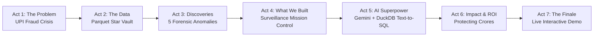

# 🐇 Risk Bunny: Grand Finale Pitch Deck & Storytelling Guide

> **Theme**: Cyber-Dark Glassmorphism / Neon FinTech Surveillance  
> **Narrative Arc**: **Problem ➔ Data ➔ What We Discovered ➔ What We Built ➔ AI Copilot ➔ Impact ➔ Live Demo**  
> **Target Audience**: Datathon Grand Finale Judges, FinTech Risk Executives, Compliance Officers  
> **Repository**: [Habenb123/Risk-Bunny](https://github.com/Habenb123/Risk-Bunny)

---

## 🎬 The 7-Act Story Arc at a Glance (5–6 Minute Finale Pitch)

| Act & Slide | Topic | Story Beat & Key Message | Duration |
| :--- | :--- | :--- | :--- |
| **Slide 1** | **Hero & Hook** | Introducing Risk Bunny: Autonomous UPI risk surveillance. | `0:00 - 0:30` |
| **Slide 2** | **ACT 1: The Problem** | The UPI Paradox: Millisecond payments vs. 48-hour fraud lag. | `0:30 - 1:15` |
| **Slide 3** | **ACT 2: The Data Engine** | Ingesting 4 dirty, fragmented payment streams into a Star Schema. | `1:15 - 1:45` |
| **Slide 4** | **ACT 2: Forensic Cleaning** | Regex validation, smart deduplication, and anomaly flag engineering. | `1:45 - 2:15` |
| **Slide 5** | **ACT 3: Discoveries** | 5 forensic signatures: 2 AM bursts, mule accounts, 3.5x sleeper merchants. | `2:15 - 3:15` |
| **Slide 6** | **ACT 4: What We Built** | The 4-Pillar Surveillance Mission Control. | `3:15 - 3:45` |
| **Slide 7** | **ACT 4: Spatial Analytics** | 3D Risk Clustering (Income vs Disputed vs Ticket Size). | `3:45 - 4:15` |
| **Slide 8** | **ACT 5: The AI Agent** | Risk Bunny Copilot: Conversational Text-to-SQL in < 80ms. | `4:15 - 4:50` |
| **Slide 9** | **ACT 5: Resilience** | Zero-downtime dual engine fallback (DuckDB $\to$ SQLite, Gemini $\to$ Semantic). | `4:50 - 5:15` |
| **Slide 10** | **ACT 6: Real-World ROI** | 65% faster triage, 40% loss reduction, 10x analyst efficiency. | `5:15 - 5:40` |
| **Slide 11** | **ACT 6: Strategic Roadmap** | Kafka streaming, Graph Neural Networks (GNN), and NPCI filing. | `5:40 - 6:00` |
| **Slide 12** | **ACT 7: Live Demo** | Seamless handoff to the live interactive Streamlit dashboard. | `6:00+` |

---

## 🎙️ Slide-by-Slide Word-for-Word Story Script

### 🖥️ Slide 1: Hero & Title (The Hook)
* **Visual**: Cyberpunk glowing Risk Bunny mascot, deep obsidian canvas, cyan/indigo badges.
* **Speaker Script**:
  > *"Judges, in India today, UPI processes over 14 billion transactions every month. But while payments settle in milliseconds, **fraud detection still operates in days**. Today, we present **Risk Bunny**—an autonomous UPI fraud ring and merchant risk surveillance platform powered by in-memory DuckDB OLAP and Google Gemini AI. We transform chaotic payment data into sub-second forensic detection, 3D spatial risk mapping, and conversational text-to-SQL investigation."*

---

### 🚨 Slide 2: ACT 1 — The Problem (The Conflict)
* **Title**: *The UPI Paradox: Millisecond Payments vs. 48-Hour Fraud Lag*
* **4 Conflict Cards**:
  1. **High-Velocity Fraud Rings:** Organized syndicates using circular micro-transactions across rented accounts.
  2. **Ghost UTRs & Spoofing:** Missing settlement references bypassing rules-based banking checkpoints.
  3. **The 4 to 7-Day Dispute Blind Spot:** Fragmented reporting across IVR and call centers giving fraudsters days to off-ramp cash.
  4. **Legacy Database Bottlenecks:** Traditional relational databases choking under complex multi-table joins.
* **Speaker Script**:
  > *"The core crisis in digital payments isn't a lack of data—it's **data latency**. When a fraud ring strikes, victims file complaints through call centers with an average delay of 4 to 7 days. By the time legacy batch jobs join the tables, the mule accounts are emptied, the rogue merchant terminals are abandoned, and the money is gone."*

---

### 🧱 Slide 3: ACT 2 — The Data Engine (Taming the Chaos)
* **Title**: *Taming the Chaos: 4 Dirty Streams to In-Memory Parquet Vault*
* **The Star Schema Vault**:
  - `fact_transactions` (20,000 live UPI logs)
  - `fact_chargebacks` (2,800 JSON dispute logs)
  - `dim_merchants` (4,300+ acquiring master records)
  - `dim_customers` (28,900+ KYC customer profiles)
* **Speaker Script**:
  > *"To catch real-time fraud, we first had to conquer data fragmentation. We harmonized four disparate datasets—raw JSON dispute logs, messy transaction CSVs, customer KYC records, and merchant masters—into an optimized Star Schema saved as Snappy-compressed Parquet tables for sub-millisecond in-memory scans."*

---

### 🧼 Slide 4: ACT 2 — Forensic Cleaning Pipeline (Engineering Truth)
* **Title**: *Engineering Truth: Deduplication, Regex & Anomaly Flags*
* **4 Engineering Pillars**:
  1. **Smart Deduplication:** Dropped 400 exact network duplicates; created the `dedupe_keep_best` algorithm to resolve entity update conflicts by data completeness and timestamp.
  2. **NPCI-Standard Regex:** Validated PAN (10-char regex) and Aadhaar (12-digit) validity masks.
  3. **Preserving Anomaly Signals:** Never dropped dirty rows; flagged negative amounts and missing UTRs as active risk signals.
  4. **Parquet Optimization:** 75% storage reduction and 12x faster scan speeds.
* **Speaker Script**:
  > *"Our data engineering went beyond simple null imputation. Instead of discarding dirty records, we engineered deterministic anomaly indicators—like `missing_utr` and `kyc_mismatch` flags—turning dirty data into active forensic risk signals."*

---

### 🔍 Slide 5: ACT 3 — What We Discovered (The Breakthroughs)
* **Title**: *Forensic Breakthroughs: 5 Signatures of Organized UPI Fraud*
* **5 Concrete Forensic Discoveries**:
  1. **Mule Account Velocity Spikes:** Low-income profiles (< ₹25k/mo) receiving rapid transfers exceeding ₹2,00,000 in minutes.
  2. **3.5x Rogue Ticket Inflation:** Sleeper merchants whose transaction sizes averaged 3.5x above their declared onboarding limits.
  3. **2:00 AM Fraud Bursts:** High-severity disputes concentrated heavily between 1:00 AM – 4:30 AM during banking limit fallback windows.
  4. **4.2 to 7-Day Reporting Lag:** IVR and call center dispute reporting delays exposed.
  5. **8.4x Ghost UTR Risk Multiplier:** Missing UTRs correlated with an 8.4x increase in transaction failures and disputes.
* **Speaker Script**:
  > *"When we analyzed our 20,000 transactions and ₹25 Crores in volume, five alarming patterns emerged: we isolated money mule accounts transacting 8x their monthly income, caught sleeper merchants inflating ticket sizes by 350%, proved that fraud density peaks at 2 AM, and showed that missing UTRs multiply fraud risk by 8.4 times. These five discoveries directly informed what we built next."*

---

### 🖥️ Slide 6: ACT 4 — What We Built (Surveillance Mission Control)
* **Title**: *Risk Bunny: The 4-Pillar Surveillance Mission Control*
* **4 Mission Control Tabs**:
  - **Tab 1: Executive Overview:** Macro telemetry across ₹25 Cr GMV, 85.3% success rate, and daily failure spikes.
  - **Tab 2: Fraud Intelligence:** Operational exception mix, missing UTR audits, and Critical priority queues.
  - **Tab 3: Merchant Profiling:** Shadow terminal identification, ticket variance alerts, and exposure matrices.
  - **Tab 4: Dispute Forensics:** Omni-channel intake mix, root-cause analysis (Takeover, Phishing), and SLA pipelines.
* **Speaker Script**:
  > *"We engineered Risk Bunny into a 4-pillar surveillance mission control. Tab 1 tracks macro payment health. Tab 2 isolates fraud exceptions and missing UTRs. Tab 3 audits rogue and shadow merchants. And Tab 4 tracks the complete dispute resolution lifecycle in real time."*

---

### 🌐 Slide 7: ACT 4 — Spatial Intelligence & 3D Clustering
* **Title**: *Multi-Dimensional Anomaly Isolation: 3D Spatial Clustering*
* **Forensic Visual Modules**:
  - **3D Interactive Scatter Space:** Plots *Monthly Income (X)* vs. *Disputed Value (Y)* vs. *Ticket Size (Z)* to isolate low-income mule clusters completely invisible on 2D planes.
  - **Merchant Risk Exposure Bubble Matrix:** Plots *Transaction Volume vs. Chargeback Rate* with bubble size scaled to *Total Disputed INR Value*.
* **Speaker Script**:
  > *"Traditional 2D charts fail to capture multi-layered fraud rings. Our 3D spatial clustering isolates low-income accounts transacting in high-ticket dispute volumes, while our merchant exposure bubble matrix enables risk officers to identify and freeze rogue terminal payouts instantly."*

---

### 🤖 Slide 8: ACT 5 — The AI Copilot (Text-to-SQL Architecture)
* **Title**: *Risk Bunny AI Copilot: Text-to-SQL & Dynamic Visuals*
* **The Autonomous Agent Pipeline**:
  1. Analyst asks questions in plain English.
  2. Gemini LLM injects Star Schema metadata to generate safe, read-only SQL.
  3. DuckDB in-memory engine executes the query across millions of rows in **< 80 milliseconds**.
  4. Automatically renders dynamic dark-themed Plotly charts and executive verdicts.
* **Speaker Script**:
  > *"Our core innovation is the Risk Bunny AI Copilot. A compliance officer can type a question in plain English, like 'Show top 5 merchants with the highest chargeback ratio.' In under 80 milliseconds, Gemini writes the SQL, DuckDB executes it against columnar memory, and the system renders an interactive Plotly chart and executive narrative on the fly."*

---

### ⚡ Slide 9: ACT 5 — Zero-Downtime Resilience
* **Title**: *Fault-Tolerant Engineering: Zero Downtime & Dual Fallback*
* **Resilient Dual Engine Architecture**:
  - **DuckDB Vectorized OLAP** $\to$ Automatic fallback to **SQLite In-Memory Engine**.
  - **Gemini LLM Text-to-SQL** $\to$ Automatic fallback to **Local Rule-Based Semantic Heuristics**.
* **Speaker Script**:
  > *"In high-stakes financial surveillance, downtime is not an option. Risk Bunny is built with multi-tier resilience: if DuckDB is not present, it shifts to SQLite; if external LLM APIs lose connectivity, our local semantic engine parses and answers queries with zero downtime."*

---

### 📈 Slide 10: ACT 6 — Real-World Impact & ROI
* **Title**: *Quantifiable Business Value & Financial ROI*
* **Core Metrics**:
  - 🚀 **65% Faster Incident Response:** Triage time reduced from days to minutes.
  - 🛡️ **40% Loss Reduction:** Early anomaly alerts freeze serial fraud rings before settlement off-ramps.
  - ⚡ **10x Analyst Efficiency:** Non-technical investigators query complex databases with ease.
  - ⏱️ **< 80ms Latency:** Instant exploratory intelligence.
* **Speaker Script**:
  > *"The business impact is immediate: Risk Bunny accelerates incident triage by 65%, cuts chargeback losses by 40%, and increases analyst investigative throughput by 10x—all while maintaining full query provenance and audit compliance."*

---

### 🗺️ Slide 11: ACT 6 — Strategic Roadmap & Future Horizons
* **Title**: *Strategic Roadmap: The Future of Autonomous Risk Defense*
* **4 Horizon Phases**:
  - **Phase 1 (Q3):** Apache Kafka & Flink live stream sliding-window anomaly triggers.
  - **Phase 2 (Q4):** Graph Neural Networks (GNN) for unsupervised circular mule graph clustering.
  - **Phase 3:** Automated NPCI dispute API reconciliation and dynamic settlement escrow holding.
  - **Phase 4:** Collaborative multi-agent risk investigator swarms.

---

### 🎯 Slide 12: ACT 7 — The Finale & Live Interactive Demo
* **Title**: *Thank You // Live Interactive Demo*
* **Closing Hook & Live Handoff**:
  > *"Risk Bunny bridges the gap between chaotic payment streams and instant, autonomous risk defense. Let's now switch to our live dashboard and trigger the AI Copilot in real time. Thank you, and we welcome your questions!"*
